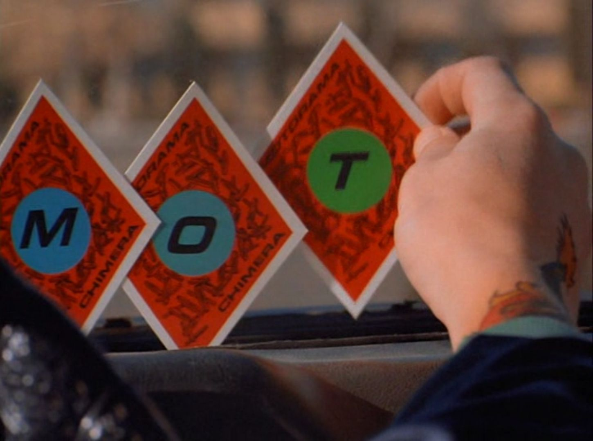

# Lab 4: Функции, "несписки", строки и картинки на выставку

Лаба: http://cs.mipt.ru/python/lessons/lab4.html.

В качестве ДЗ достаточно решить *6 задач*: одну по функциям (по рекурсии), две по "неспискам", две по строкам и одну по "Картинкам на выставку".

По некоторым номерам в названии задачи есть ссылка на ресурс [Питонтьютор](https://pythontutor.ru).
Если выбор в плане решения падает на такую задачу, рекомендуется перейти по соответствующей ссылке, чтобы посмотреть более полную версию условия (с примерами).
(И, кроме условия, можно будет при желании и небольшую теорсправку там же на сайте почитать.)


## Рекурсия

### Задача R1 (Факториал)

Напишите рекурсивную функцию, вычисляющую факториал числа:

```python
def factorial(n):
    # Рекурсивно вычисляет факториал

print(factorial(3))  # 6
```


### Задача R2 (Отрицательная степень)

https://pythontutor.ru/lessons/functions/problems/negative_power.

Дано действительное положительное число `a` и *целоe* число `n`.
Вычислите $a^n$.
Решение оформите в виде рекурсивной функции `power(a, n)`.

(Стандартной функцией возведения в степень пользоваться нельзя.)

Пример:
```
# Вход:
2
-3

# Выход:
0.125
```


## "Несписки"

Предполагается, что в каждой задаче этого раздела будет не лишним, кроме, возможно, "обычных" списков (`list`), воспользоваться и другими типами данных для хранения и обработки нескольких элементов: множествами (`set`) или кортежами (`tuple`).


### Задача NL1 (MOTORAMA)

Компания "Motorama" проводит розыгрыш суперприза.

В каждой пачке с овсянкой спрятана маленькая карточка с буквой.
Всего есть восемь различных карточек: `'1_M'`, `'2_O'`, `'3_T'`, `'4_O'`, `'5_R'`, `'6_A'`, `'7_M'`, `'8_A'` (у каждой карточки есть номер, то есть, например, с буквой `'M'` есть две различные карточки).
Первый, кто соберёт все карточки (то есть чтобы получилось слово "MOTORAMA"), получит право на суперприз в виде супербольшой суммы денег.

Несколько человек собирали эти карточки, но ни у одного не получилось собрать полный комплект.
Смогут ли они победить, объединив усилия?

В файле [motorama.txt](./files/motorama.txt) на каждой строчке через пробел перечислены карточки, собранные отдельными охотниками за призом (каждая строчка — карточки одного человека).
Напишите программу, которая определяет, получится ли составить слово "MOTORAMA", если объединить вместе все карточки разных людей.
(Выход программы — одно слово: "ДА", если можно, и "НЕТ", если нельзя.)

<p align="center">
  
</p>
<p align="center">
  <em>
    Motorama, 1991 (<a href="https://www.kinopoisk.ru/film/1820">https://www.kinopoisk.ru/film/1820</a>).
  </em>
</p>


### Задача NL2 (Белый)

<div>
  <em>
    <p align="right">
      ...Мокрый снег залепил молочные стекла оранжереи.
	  Ветер трепал хвосты вымпелов и покачивал далекие верхушки мачт недостроенного флота.
	  С моря наползал туман.
    </p>
	<p align="right">
	  ("Буря крыльев", М. Джон Харрисон. Перевод: Татьяна Серебряная)
	</p>
  </em>
</div>

Говорят, что [эскимосы различают десятки (если даже не сотни) оттенков и состояний снега](https://ru.wikipedia.org/wiki/%D0%AD%D1%81%D0%BA%D0%B8%D0%BC%D0%BE%D1%81%D1%81%D0%BA%D0%B8%D0%B5_%D0%BD%D0%B0%D0%B7%D0%B2%D0%B0%D0%BD%D0%B8%D1%8F_%D1%81%D0%BD%D0%B5%D0%B3%D0%B0).
А сколько оттенков белого сможете найти вы с помощью программы на Питоне?

В цветовой модели RGB каждый цвет представляется как "смесь" трёх цветов в разной пропорции: красного (R), зелёного (G) и синего (B).
Доли каждого из трёх цветов можно представлять как действительное число от 0 до 1.
Или, ещё один популярный вариант, как целое число от 0 до 255.
Например, вот  цвет, который в RGB координатах представляется как (250, 37, 154) или (0.980, 0.145, 0.604).

В файле [colours.txt](./files/colours.txt) построчно записаны цвета.
Каждый цвет — как три RGB компоненты (целые числа), разделённые пробелом.
Напишите программу, которая бы определила, сколько в указанном файле содержится оттенков белого цвета.
*Белым будет считать такой цвет, у которого каждая из трёх RGB компонент не меньше 230*.

Результат работы программы — одно число, количество оттенков белого.
Это число можно вывести на экран с помощью функции `print` или записать в файл с именем `result.txt`.


### Задача NL3 (Скроблс)

Музыка для Маши — это больше, чем просто приятный "фонозаполнитель".
Музыка может словно дарить крылья, позволяя красочнее ощущать какие-то моменты.
Или может в хорошем смысле отвлекать, позволяя оставаться на плаву, когда ощущать уже больше вообще ничего не хочется.
(Лабы по физике Маша оформляет только с музыкой.)

В файле [scrobbles.txt](./files/scrobbles.txt) вперемешку представлена история прослушиваний Маши за некоторый промежуток времени.
Формат записей: каждая строчка — это отдельный трек, сначала пишется имя группы, потом пробел, дефис, снова пробел, и название трека.
Например, возможная строчка: `Chromatics - Shadow`.

Напишите программу, определяющую количество *различных исполнителей*, которых слушала Маша.

Например:
```
# Вход:
Chromatics - Shadow
Chromatics - Shadow
Julee Cruise - Falling
Julee Cruise - The World Spins
Chromatics - Shadow

# Выход:
2
```

Результат можно просто вывести на экран или записать в файл с именем `result.txt`.


### Задача NL4 (Гастингс проводит расследование)

Пока Пуаро внимательно осматривает в парке место убийства, капитан Гастингс решил попробовать следующий интересный метод поиска убийцы.

У Гастингса есть список всех подозреваемых и возможность задавать вопросы каждому из них.
Все из них отрицают, что были в парке в момент совершения убийства прошлой ночью.
Однако Гастингс чувствует, что кто-то из них врёт.
А если в чём-то врёшь, то не сложно рано или поздно самому запутаться в показаниях.
Поэтому Гастингс решает провести "китайский допрос с пристрастием".[^Hastings]
Он многократно задаёт подозреваемым один и тот же вопрос: "Где вы были прошлой ночью в момент убийства?"
И записывает их ответы в файл [suspects_answers.txt](./files/suspects\_answers.txt).
В формате: одна строчка — один ответ.
Сначала записывается имя человека, потом пробел-дефис-пробел, потом ответ (место нахождения в момент убийства).
Например, строка `Паркер - Паб` означает, что подозреваемый Паркер был в пабе.

Помогите Гастингсу — напишите программу, которая просмотрит все ответы в указанном файле и найдёт убийцу.
Убийца — это тот человек, который "запутается в показаниях": сначала назовёт одно место, а потом другое.
Программа должна вывести на экран (или записать в файл с именем `result.txt`) имя убийцы или строчку `"Надо продолжать допрос!"`, если убийца пока не найден.

Пример:
```
# Вход:
Паркер - Паб
Паркер - Паб
Паркер - Клуб

# Выход:
Паркер
```

```
# Вход:
Паркер - Паб
Паркер - Паб
Паркер - Паб

# Выход:
Надо продолжать допрос!
```

<p align="center">
  
</p>
<p align="center">
  <em>
    Хью Фрейзер в роли Артура Гастингса (<a href="https://pinterest.com/pin/468374429966964448/">https://pinterest.com/pin/468374429966964448</a>).
  </em>
</p>


### Задача NL5 (Количество совпадающих чисел)

https://pythontutor.ru/lessons/sets/problems/number_of_coincidental.

Даны два *списка* чисел.
Посчитайте, сколько чисел содержится одновременно как в первом списке, так и во втором.

Пример:
```
# Вход:
1 3 2
4 3 2

# Выход:
2
```


### Задача NL6 (Встречалось ли число раньше)

https://pythontutor.ru/lessons/sets/problems/occurs_before.

Во входной строке записана последовательность чисел через пробел.
Для каждого числа выведите слово `'YES'` (в отдельной строке), если это число ранее встречалось в последовательности, или `'NO'`, если не встречалось.

Пример:
```
# Вход:
1 2 3 2 3 4

# Выход:
NO
NO
NO
YES
YES
NO
```


### Задача NL7 (Количество слов в тексте)

https://pythontutor.ru/lessons/sets/problems/number_of_words.

Дан текст: в первой строке записано число строк, далее идут сами строки. Определите, сколько различных слов содержится в этом тексте.

Словом считается последовательность непробельных символов, идущих подряд; слова разделены одним или бо&#769;льшим числом пробелов или символами конца строки.

Пример:
```
# Вход:
4
She sells sea shells on the sea shore;
The shells that she sells are sea shells I'm sure.
So if she sells sea shells on the sea shore,
I'm sure that the shells are sea shore shells.

# Выход:
19
```


## Строки

### Задача S1 (Сумма цифр)

Напишите функцию, которая находит сумму всех цифр в поданной на вход строке.
(Принимает строку, возвращает число — сумму цифр.)

```python
def sum_digits(s):
    # Суммирует цифры

print(sum_digits("Hello world!"))    # 0
print(sum_digits("He11o wor1d!"))    # 3
print(sum_digits("123"))             # 6
print(sum_digits("abc1efg2hij3"))    # 6
print(sum_digits("10 + 3 > -17.5"))  # 17
```


### Задача S2 (Заборчик в Зазеркалье)

Напишите функцию, принимающую на вход строку и возвращающую новую строку, построенную по исходной, так что "маленькие" буквы становятся "большими" и наоборот.

```python
def mirror_case(s):
    # Меняет регистр с маленького на большой и наоборот

print(mirror_case("ЗаБоРчИк"))  # зАбОрЧиК
```


### Задача S3 (Story of My Life)

Напишите функцию, которая получает на вход несколько фактов о человеке и составляет по ним короткое связное описание.

Параметры функции:
* имя (строка)
* возраст (целое число)
* средняя оценка по предметам (число с плавающей точкой)
* хобби (список строк)
* любимое блюдо (строка)

Функция возвращает одну строку – связный "рассказ" о человеке.
Рассказ строится по шаблону, суть которого лучше увидеть на примере:

```python
def make_description(name, age, grade, hobbies, favourite_food):
    # Составляет описание

description = make_description(
    name='Ник', age=18, grade=7.4, favourite_food='ролл Калифорния',
    hobbies=['бадминтон', 'бас-гитара', 'прокрастинация'],
)

print(description)  # Меня зовут Ник, мне 18 лет. Средняя оценка 7,4. Из еды очень люблю ролл Калифорния. Мои хобби: бадминтон, бас-гитара и прокрастинация.
```

<p align="center">
  
</p>
<p align="center">
  <em>
    Lollipop Chainsaw, 2012 (<a href="https://lollipopchainsaw.fandom.com/wiki/Nick_Carlyle">https://lollipopchainsaw.fandom.com/wiki/Nick_Carlyle</a>).
  </em>
</p>


### Задача S4 (sraey evif ytnewt ni niaga uoy ees ll'i)

Строки файла [encrypted.txt](./files/encrypted.txt) "зашифрованы": записаны задом наперёд.
Напишите программу, которая переворачивает все строки обратно и записывает результат в файл `result.txt`.

Пример:
```
# Вход
olleh
dlrow

# Выход
hello
world
```


### Задача S5 (Тихие крики)

Будем считать "криком" слово, состоящее из нескольких (больше одной) подряд идущих символов `"A"`, за которыми стоит восклицательный знак.
Например, `"AAA!"` это крик, `"AAAAAAA!"` тоже.
Но `"AAA."` криком не считается, как и `"A!"`.
Напишите программу, которая в строке заменяет все "крики" на строку `"Аа."` (более "тихая" версия крика).

Например:
```
# Вход
Принести ещё пива? Хорошо, сейчас вернусь... ААААА!

# Выход
Принести ещё пива? Хорошо, сейчас вернусь... Аа.
```

```
# Вход
ААА! Какой ужас! занавески зелёные, обои красные! ААААААА!

# Выход
Аа. Какой ужас! занавески зелёные, обои красные! Аа.
``` 

```
# Вход
Мы батарейки ААА, или "мизинчики".

# Выход
Мы батарейки ААА, или "мизинчики".
``` 


### Задача S6 (Искусственный интеллект)

Напишите функцию, которая в поданной ей на вход строке находит все имена (возвращает имена как список строк).

<em>Достаточно, если функция будет правильно работать только на приведённом примере.
Однако решение всё-таки должно быть осмысленное, а не просто "вернуть правильный ответ".</em>


```python
def find_names(s):
    # Ищет имена в тексте

text = """
Привет! Меня зовут Анжелика.
Кто он? Его имя Данте.
Как только я сказал, что меня зовут Джон, мне дали пройти.
Маша, пойдём сегодня гулять?
Моё имя Фредди. Теперь вы знаете, как зовут ваш ночной кошмар.
Этот меч теперь твой, Хорнрак.
Игорь, быстрее, клади его на стол, начинается гроза!
"""

names = find_names(text)

print(names)  # ['Анжелика', 'Данте', 'Джон', 'Маша', 'Фредди', 'Хорнрак', 'Игорь']
```


### Задача S7 (Делаем срезы)

https://pythontutor.ru/lessons/str/problems/slices.

Дана строка.
Сначала выведите третий символ этой строки.
Во второй строке выведите предпоследний символ этой строки.
В третьей строке выведите первые пять символов этой строки.
В четвертой строке выведите всю строку, кроме последних двух символов.
В пятой строке выведите все символы с чётными индексами (считая, что индексация начинается с 0, поэтому символы выводятся начиная с первого).
В шестой строке выведите все символы с нечётными индексами, то есть начиная со второго символа строки.
В седьмой строке выведите все символы в обратном порядке.
В восьмой строке выведите все символы строки через один в обратном порядке, начиная с последнего.
В девятой строке выведите длину данной строки.

Пример:
```
# Вход:
Abrakadabra

# Выход:
r
r
Abrak
Abrakadab
Arkdba
baaar
arbadakarbA
abdkrA
11
```


### Задача S8 (Первое и последнее вхождения)

https://pythontutor.ru/lessons/str/problems/first_and_last_occurences.

Дана строка.
Если в этой строке буква `'f'` встречается только один раз, выведите её индекс.
Если она встречается два и более раз, выведите индекс её первого и последнего появления.
Если буква `'f'` в данной строке не встречается, ничего не выводите.

Пример:
```
# Вход:
office

# Выход:
1 2
```


### Задача S9 (Второе вхождение)

https://pythontutor.ru/lessons/str/problems/second_occurence.

Дана строка.
Найдите в этой строке *второе* вхождение буквы `'f'`, и выведите индекс этого вхождения.
Если буква `'f'` в данной строке встречается только один раз, выведите число -1, а если не встречается ни разу, выведите число -2.

Пример:
```
# Вход:
coffee

# Выход:
3
```


### Задача S10 (Удаление фрагмента)

https://pythontutor.ru/lessons/str/problems/delete_chunk.

Дана строка, в которой буква `'h'` встречается минимум два раза.
Удалите из этой строки первое и последнее вхождение буквы `'h'`, а также все символы, находящиеся между ними.

Пример:
```
# Вход:
In the hole in the ground there lived a hobbit

# Выход:
In tobbit
```


### Задача S11 (Обращение фрагмента)

https://pythontutor.ru/lessons/str/problems/reverse_chunk.

Дана строка, в которой буква `'h'` встречается как минимум два раза.
Разверните последовательность символов, заключённую между первым и последним появлением буквы `'h'`, в противоположном порядке.

Пример:
```
# Вход:
In the hole in the ground there lived a hobbit

# Выход:
In th a devil ereht dnuorg eht ni eloh ehobbit
```


## Картинки на выставку

См. [задание 2 из лабы про Картинки](http://cs.mipt.ru/python/lessons/lab4.html#o2-1): надо с помощью библиотеки `pygame` нарисовать любую из приведённых на сайте картинок.


[^Hastings]: Термин придумал сам Гастингс. Возможно, он таким образом проводит аналогию между своим способом допроса и [китайской пыткой водой](https://en.wikipedia.org/wiki/Chinese\_water\_torture). Один и тот же многократно повторяющийся вопрос как бы "капает" на психику убийцы (и не только убийцы), пока он или она окончательно не расколется.
