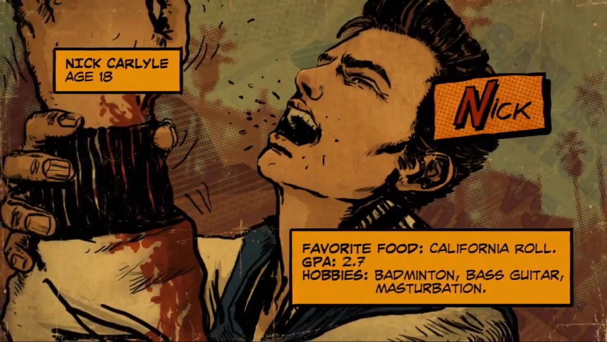

# Lab 4: Рекурсия, "несписки", строки и картинки на выставку

Лаба: http://cs.mipt.ru/python/lessons/lab4.html.

В качестве ДЗ достаточно решить *четыре* задачи: одну по функциям, одну по "неспискам", одну по строкам и одну по "Картинкам на выставку".


## Рекурсия

### Задача F1 (Факториал)

Напишите рекурсивную функцию, вычисляющую факториал числа:

```python
def factorial(n):
    # ... Рекурсивная функция ...

print(factorial(3))  # 6
```


## "Несписки"


### Задача NL... (MOTORAMA)

Компания "Motorama" проводит розыгрыш за суперприз.

В каждой пачке с овсянкой спрятана маленькая карточка с буквой.
Всего есть восемь различных карточек: `'1_M'`, `'2_O'`, `'3_T'`, `'4_O'`, `'5_R'`, `'6_A'`, `'7_M'`, `'8_A'` (у каждой карточки есть номер, то есть, например, с буквой `'M'` есть две различные карточки).
Первый, кто соберёт все карточки (чтобы получилось слово "MOTORAMA"), получит право на суперприз в виде супербольшой суммы денег.

Несколько человек собирали эти карточки, но ни у одного не получилось собрать полный комплект.
Смогут ли они победить, объединив усилия?

В файле [motorama.txt](./files/motorama.txt) на каждой строчке через пробел перечислены карточки, собранные отдельными охотниками за призом (каждая строчка — карточки одного человека).
Напишите программу, которая определяет, получится ли составить слово "MOTORAMA", если объединить вместе все карточки разных людей.
(Выход программы — одно слово: "ДА", если можно, и "НЕТ", если нельзя.)


### Задача NL (Белый)

<div>
  <em>
    <p align="right">
      ...Мокрый снег залепил молочные стекла оранжереи.
	  Ветер трепал хвосты вымпелов и покачивал далекие верхушки мачт недостроенного флота.
	  С моря наползал туман.
    </p>
	<p align="right">
	  ("Буря крыльев", М. Джон Харрисон)
	</p>
  </em>
</div>

Говорят, что [эскимосы различают десятки (если даже не сотни) оттенков и состояний снега](https://ru.wikipedia.org/wiki/%D0%AD%D1%81%D0%BA%D0%B8%D0%BC%D0%BE%D1%81%D1%81%D0%BA%D0%B8%D0%B5_%D0%BD%D0%B0%D0%B7%D0%B2%D0%B0%D0%BD%D0%B8%D1%8F_%D1%81%D0%BD%D0%B5%D0%B3%D0%B0).
А сколько оттенков белого сможете найти вы с помощью программы на Питоне?

В цветовой модели RGB каждый цвет представляется как "смесь" трёх цветов в разной пропорции: красного (R), зелёного (G) и синего (B).
Доли каждого из трёх цветов можно представлять как действительное число от 0 до 1.
Или, ещё один популярный вариант, как целое число от 0 до 255.
Например, вот  цвет, который в RGB координатах представляется как (250, 37, 154), или (0.980, 0.145, 0.604).

В файле [colours.txt](./files/colours.txt) построчно записаны цвета.
Каждый цвет — как три RGB компоненты (целые числа), разделённые пробелом.
Напишите программу, которая бы определила, сколько в указанном файле содержится оттенков белого цвета.
*Белым будет считать такой цвет, у которого каждая из трёх RGB компонент не меньше 230*.

Результат работы программы — одно число, количество оттенков белого.
Это число можно вывести на экран с помощью функции `print` или записать в файл с именем `result.txt`.


### Задача (Скроблс)

Музыка для Маши — это больше, чем просто приятный "фонозаполнитель".
Музыка может словно дарить крылья, позволяя красочнее ощущать какие-то моменты.
Или может в хорошем смысле отвлекать, позволяя оставаться на плаву, когда ощущать уже больше вообще ничего не хочется.
(Лабы по физике Маша оформляет только с музыкой.)

В файле [scrobbles.txt](./files/scrobbles.txt) вперемешку представлена история прослушиваний Маши за некоторый промежуток времени.
Формат записей: каждая строчка — это отдельный трек, сначала пишется имя группы, потом пробел, дефис, снова пробел, и название трека.
Например, возможная строчка: `Chromatics - Shadow`.

Напишите программу, определяющую количество *различных исполнителей*, которые слушала Маша.

Например:
```
# Вход:
Chromatics - Shadow
Chromatics - Shadow
Julee Cruise - Falling
Julee Cruise - The World Spins
Chromatics - Shadow

# Выход:
2
```

Результат можно просто вывести на экран или записать в файл с именем `result.txt`.


### Задача NL... (Гастингс проводит расследование)

Пока Пуаро внимательно осматривает в парке место убийства, капитан Гастингс решил попробовать следующий интересный метод поиска убийцы.

У Гастингса есть список всех подозреваемых и возможность задавать вопросы каждому из них.
Все из них отрицают, что были в парке в момент убийства прошлой ночью.
Однако Гастингс понимает, что кто-то из них врёт.
А если в чём-то врёшь, то не сложно рано или поздно самому запутаться в показаниях.
Поэтому Гастингс решает провести "китайский допрос с пристрастием".[^Hastings]
Он многократно задаёт подозреваемым один и тот же вопрос: "Где вы были прошлой ночью в момент убийства?"
И записывает их ответы в файл [suspects_answers.txt](./files/suspects\_answers.txt).
В формате: одна строчка — один ответ.
Сначала записывается имя человека, потом пробел-дефис-пробел, потом ответ (место нахождения в момент убийства).
Например, строка `Паркер - Паб` означает, что подозреваемый с именем Паркер в момент убийства был в пабе.

Помогите Гастингсу — напишите программу, которая просмотрит все ответы в указанном файле и найдёт убийцу.
Убийца — это тот человек, который "запутается в показаниях": сначала назовёт одно место, а потом другое.
Программа должна вывести на экран (или записать в файл с именем `result.txt`) имя убийцы или строчку `"Надо продолжать допрос!"`, если убийца пока не найден.


## Строки


### Задача S... (Сумма цифр)

Напишите функцию, которая находит сумму всех цифр в поданной на вход строке.
(Принимает строку, возвращает число — сумму цифр.)

```
def sum_digits(s):
    # Суммирует цифры

print(sum_digits("Hello world!"))    # 0
print(sum_digits("He11o wor1d!"))    # 3
print(sum_digits("123"))             # 6
print(sum_digits("abc1efg2hij3))     # 6
print(sum_digits("10 + 3 > -17.5"))  # 17
```


### Задача S... (Заборчик в Зазеркалье)

Напишите функцию, принимающую на вход строку и возвращающую новую строку, построенную по исходной, так что "маленькие" буквы становятся "большими" и наоборот.

```python
def mirror_case(s):
    # Меняет регистр с маленького на большой и наоборот

print(mirror_case(""))
```


### Задача S... (Story of My Life)

Напишите функцию, которая получает на вход несколько фактов о человеке и составляет по ним короткое связное описание.

Параметры функции:
* имя (строка)
* возраст (целое число)
* средняя оценка по предметам (число с плавающей точкой)
* хобби (список строк)
* любимое блюдо (строка)

Функция возвращает одну строку – связный "рассказ" о человеке.
Рассказ строится по шаблону, суть которого лучше увидеть на примере:

```python
def make_description(name, age, grade, hobbies, favourite_food):
    # Составляет описание

description = make_description(
    name='Ник', age=18, grade=7.4, favourite_food='ролл Калифорния',
    hobbies=['бадминтон', 'бас-гитара', 'прокрастинация'],
)

print(description)

# Меня зовут Ник, мне 18 лет. Средняя оценка 7,4. Из еды очень люблю ролл Калифорния. Мои хобби: бадминтон, бас-гитара и прокрастинация.
```

<p align="center">
  
</p>
<p align="center">
  <em>
    Источник примера (<a href="https://lollipopchainsaw.fandom.com/wiki/Nick_Carlyle">https://lollipopchainsaw.fandom.com/wiki/Nick_Carlyle</a>).
  </em>
</p>


### Задача S... (sraey evif ytnewt ni niaga uoy ees ll'i)

Строки файла [encryped_strings.txt](./files/encryped_strings.txt) "зашифрованы": записаны задом наперёд.
Напишите программу, которая переворачивает все строки обратно и записывает результат в файл `result.txt`.

Пример:
```
# Вход
olleh
dlrow


# Выход
hello
world
```


### Задача S... (Тихие крики)

Будем считать "криком" слово, состоящее из нескольких (больше одной) подряд идущих символов `"A"`, за которыми стоит восклицательный знак.
Например, `"AAA!"` это крик, `"AAAAAAA!"` тоже.
Но `"AAA."` криком не считается, как и `"A!"`.
Напишите программу, которая в строке заменяет все "крики" на строку `"Аа."` (более "тихая" версия крика).

Например:
```
# Вход
Принести ещё пивка? Хорошо, сейчас вернусь... ААААА!

# Выход
Принести ещё пивка? Хорошо, сейчас вернусь... Аа.
```

```
# Вход
ААА! Занавески зелёные, обои красные! ААААААА!

# Выход
Аа. Занавески зелёные, а обои красные! Аа.
``` 

```
# Вход
Мы батарейки ААА, или "мизинчики".

# Выход
Мы батарейки ААА, или "мизинчики".
``` 


### Задача S... (Искусственный интеллект)

Напишите функцию, которая в поданной ей на вход строке находит все имена (возвращает имена как список строк).


```python
def find_names(s):
    # Ищет имена в тексте

text = """
Привет! Меня зовут Анжелика.
Кто он? Его имя Данте.
Как только я сказал, что меня зовут Джон, мне дали пройти.
Маша, пойдём сегодня гулять?
Моё имя Фредди. Теперь вы знаете, как зовут ваш ночной кошмар.
Этот меч теперь твой, Хорнрак.
Игорь, быстрее, клади его на стол, скоро будет гроза!
"""

names = find_names(text)

print(names)  # ['Анжелика', 'Данте', 'Джон', 'Маша', 'Фредди', 'Хорнрак', 'Игорь']
```


## Картинки на выставку


[^Hastings]: Термин придумал сам капитан Гастингс. Возможно, Гастингс так сравнивает свой способ допроса путём многократного повторения одного и того же вопроса с [китайской пыткой водой](https://en.wikipedia.org/wiki/Chinese\_water\_torture). Вопрос как бы "капает" на психику убийцы (и не только), пока он или она окончательно не расколется.
