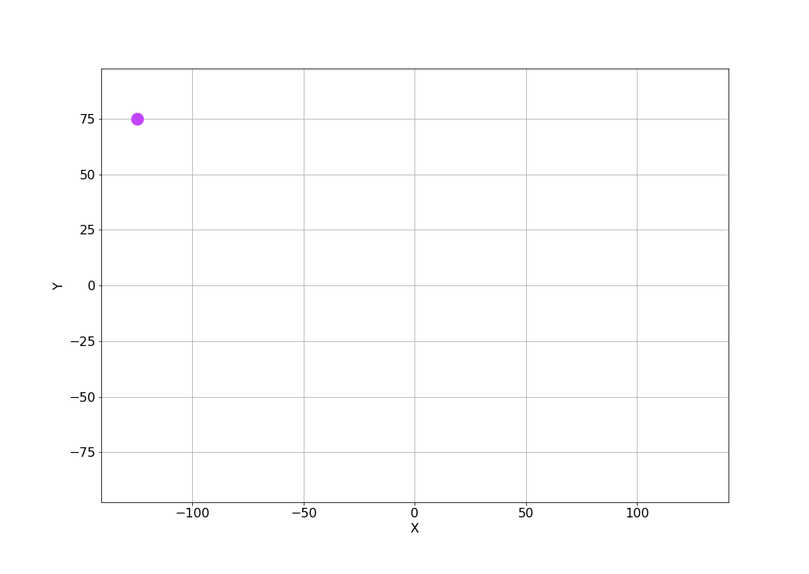
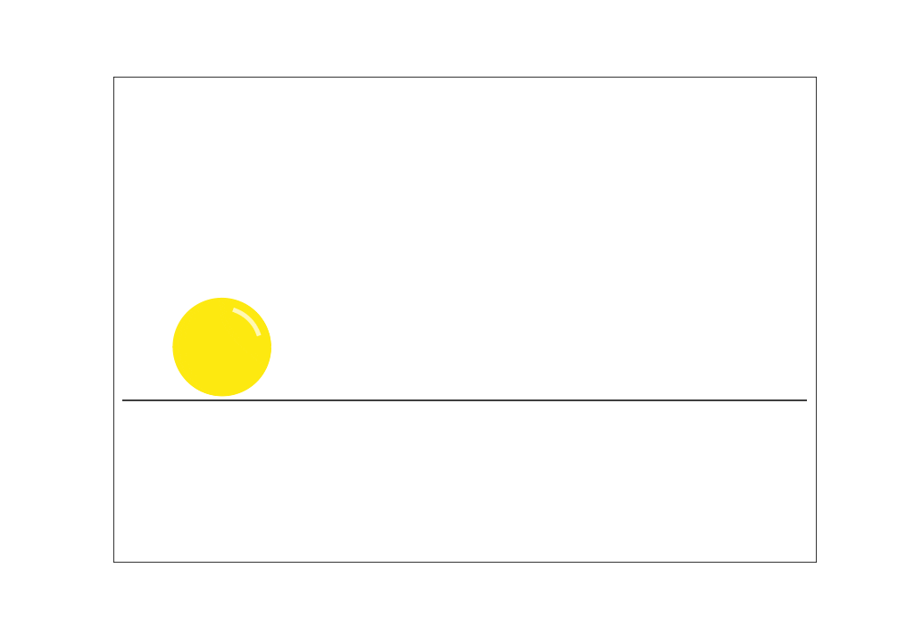
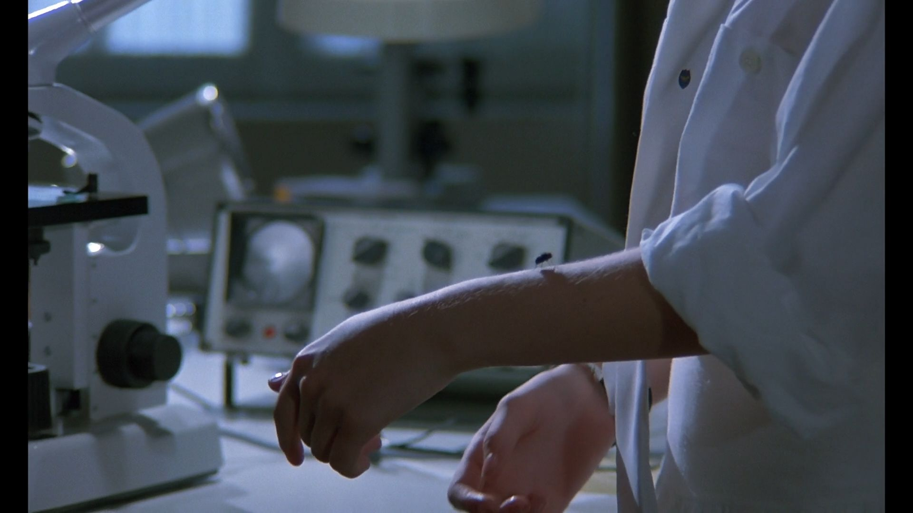
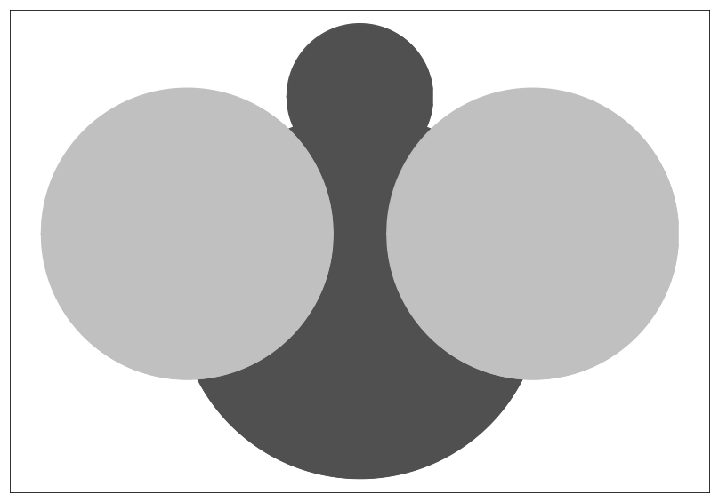
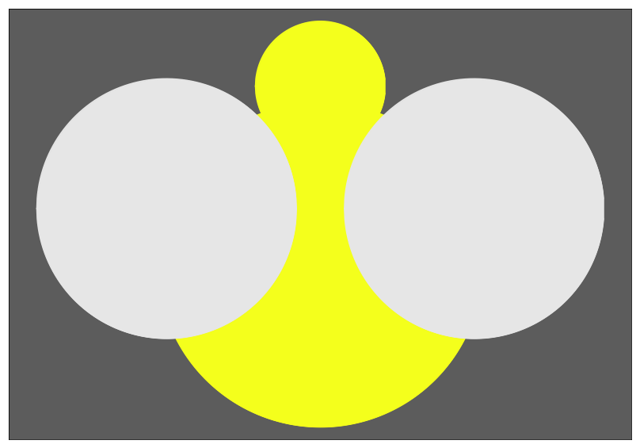
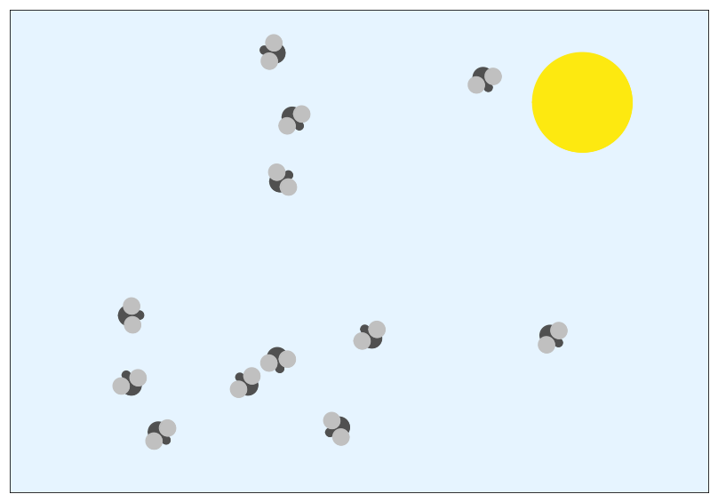
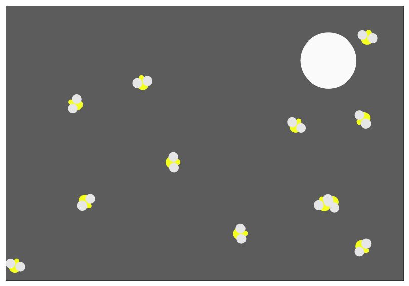

# Lab 5: Декомпозиция и картинки на выставку

Лаба: http://cs.mipt.ru/python/lessons/lab5.html.

В качестве ДЗ достаточно решить одну задачу путём осмысленной разбивки программы на функции.


## Задачи

### Задача 1 (Черепашка рисует индекс)

Задача из лабы про Черепашку: http://cs.mipt.ru/python/lessons/lab3.html#section-8.

Надо написать программу, которая принимает со стандартного входа (то есть через `input`) индекс и отрисовывает его с помощью Черепашки.

Индекс должен состоять ровно из шести десятичных цифр.
Если со входа придёт число из большего или меньшего числа цифр, то Черепашке ничего рисовать не надо.
Вместо этого надо просто вывести на экран (то есть через `print`) строчку: `"Не индекс! Должно быть 6 цифр, а не {}!"`, где вместо `{}` надо подставить количество цифр в полученной со входа строке.


### Задача 2 ("Структурная" картинка на выставку)

Любая задача из лабы про Картинки (последнее упражнение): http://cs.mipt.ru/python/lessons/lab4.html#o3.


### Задача 3 (Предобработка текста)

В файле [raw_texts.txt](./files/raw_texts.txt) приведены три отрывка из рахных статей Википедии: по отрывку на каждой строчке.
Надо *предобработать* эти тексты, то есть из человекопонятного формата привести к такому, с которым проще было бы работать программе (модели машинного обучения, например).
Будем считать, что тексты надо предобработать с той целью, чтобы можно было определить *тематику* текста, то есть о чём в нём вообще говорится.
Наивный способ понять тематику — просто посчитать частоты слов в тексте.
Ведь кажется, что если слово встречается чаще других, то про него и больше говорится в тексте.
Однако такой способ (подсчёт частот без предобработки), скорее всего, не приведёт к адекватным результатам, потому что, во-первых, есть разные формы слов.
Например, "муравья" и "муравьям" — хотелось бы, чтобы два таких слова давали вклад в одну и ту же тему "муравей", но ведь частоты по ним будут считаться отдельно.
Во-вторых, самые частые слова текста, как правило, совершенно неинформативные — это слова "общей лексики", слова "ни о чём".
Их можно называть *стоп-словами*.
Например, это слова "он", "она", "под", "чё", "ща", "который", "сказал" и т.п.
И как раз с этой целью, правильного подсчёта частот слов в тексте для определения его тематики, и предлагается провести предобработку.
Состояющую из нескольких шагов:
1. Привести текст к нижнему регистру.
2. Убрать знаки препинания.
3. Убрать стоп-слова.
3. "Нормализовать" слова.
4. Убрать стоп-слова (ещё раз).
5. Убрать слова, состоящие из не более чем трёх букв.

Под нормализацией как раз имеется в виду процесс "упрощения" слова (чтобы "муравья" и "муравьям" стали чем-то "одним").
Есть два популярных способа нормализации: "грубый" ([стемминг](https://en.wikipedia.org/wiki/Stemming)) и "деликатный" ([лемматизация](https://en.wikipedia.org/wiki/Lemmatization)).

В данной задаче предлагается простоты ради использовать следующий "вариант" стемминга: чтобы упростить слово, надо отрезать от него конец, начиная с первой гласной в последней из подряд идущих групп гласных (😅).
Возможно, проще показать предлагаемую "нормализацию" на примере:
```
муравья -> муравь       # отрезаем начиная с "я"
муравьям -> муравь      # отрезаем начиная с "я"
стеклянная -> стеклянн  # отрезаем начиная с "а" (последняя группа подряд идущих гласных "ая")
стеклянный -> стеклянн  # отрезаем начиная с "ы"
саркофаг -> саркоф      # отрезаем начиная с "а"
```

Для того чтобы удалить стоп-слова из текста, проще всего воспользоваться готовым списком стоп-слов (например, отсюда: https://github.com/stopwords-iso/stopwords-ru/blob/master/stopwords-ru.txt).
Внимательный читатель мог заметить, что в пайплайне предобработки удаление стоп-слов предлагается проводить два раза.
Это связано с "простоватой" нормализацией: с одной стороны, стоит удалить стоп-слова до нормализации, потому что окончание может отрезаться криво и слово не будет найдено в списке стоп-слов; с другой стороны, нормализация может и хорошо сработать, и тогда, наоборот, после обрезания на конце лишнего — слово будет найдено в списке стоп-слов.

Результат предобработки текстов из входного файла надо записать так же построчно в файл "result.txt".

Пример описанной предобработки:
```
# Вход:
Муравьи живут семьями в гнёздах, называемых муравейниками, которые устраивают в почве, древесине, под камнями; некоторые сооружают муравейники из мелких растительных частиц и т. п. Существуют паразитические виды, которые обитают в гнёздах других муравьёв, муравьи-«рабовладельцы», содержащие в своих гнёздах «рабов» — муравьёв других видов. Ряд видов приспособился к обитанию в жилищах человека. Некоторые виды ценятся за регулирование численности насекомых-вредителей, другие могут считаться вредителями.

# Выход (самые частые слова теперь — это "муравь" и "гнёзд"):
муравь семьям гнёзд называем муравейникам устраив почв древесин камням некотор сооруж муравейник мелк растительн част существ паразитическ обит гнёзд муравь муравь рабовладельц содержащ гнёзд муравь приспособилс обитан жилищ некотор ценятс регулирован численност насеком вредител считатьс вредителям
```

---

Ссылки на использованные статьи Википедии:
* [Муравьи](https://ru.wikipedia.org/wiki/%D0%9C%D1%83%D1%80%D0%B0%D0%B2%D1%8C%D0%B8).
* [Красная Шапочка](https://ru.wikipedia.org/wiki/%D0%9A%D1%80%D0%B0%D1%81%D0%BD%D0%B0%D1%8F_%D0%A8%D0%B0%D0%BF%D0%BE%D1%87%D0%BA%D0%B0).
* [Мокрая химия](https://ru.wikipedia.org/wiki/%D0%9C%D0%BE%D0%BA%D1%80%D0%B0%D1%8F_%D1%85%D0%B8%D0%BC%D0%B8%D1%8F).


### Задача 4 (Химические реакции)

В файле [reactions.txt](./files/reactions.txt) записано несколько химических реакций, по одной на строчке.
Для каждой реакции надо выяснить следующее:
1. Количество участников реакции.
2. Количество продуктов реакции.
3. Явлется ли реакция эндотермический (теплота поглощается, и в левой части уравнения есть слагаемое `+ Q`), экзотермической (теплота выделяется, и в правой части уравнения есть слагаемое `+ Q`) или не понятно (нигде не указано слагаемое `+ Q`).
4. Реагент с самой большой массой и его массу (массу в граммах стольких молей вещества, сколько указано в формуле реакции).
5. Продукт с самой большой массой и его массу (массу в граммах стольких молей вещества, сколько указано в формуле реакции).

Ответ для каждой формулы надо записать на соответствующей строчке в файле "result.txt".

Пример:
```
# Вход:
2H2 + O2 -> 2H2O + Q

# Выход:
2, 1, экзотермическая, O2 (32 г), 2H2O (36 г)


# Вход:
2H2 + O2 -> 2H2O

# Выход:
2, 1, не понятно, O2 (32 г), 2H2O (36 г)
```


### Задача 5 ("Анимированный" график, или Колобок)

Постройте какой-нибудь "анимированный график".
Для этого предлагается просто построить несколько отдельных графиков с помощью стандартной `plt.plot`, сохранить их (`plt.savefig`) и потом объединить в целостную гифку (рекомендуется использовать библиотеку `imageio`, см.: https://stackoverflow.com/a/45258744/8094251).

Примеры:

<p align="center">
  
</p>
<p align="center">
  <em>
    "Разворачивающийся" график квадратичной функции
	(<a href="https://media.giphy.com/media/v1.Y2lkPTc5MGI3NjExd3oyaTIwMTdqMmxoajk0YjFkbXpzOWlyOGtoc3N4dGZrZXpveGNtOCZlcD12MV9pbnRlcm5hbF9naWZfYnlfaWQmY3Q9Zw/AV45wiIzUafSGTDi7V/giphy.gif">gif</a>).
  </em>
</p>

<p align="center">
  
</p>
<p align="center">
  <em>
    Небольшой "мультик" про Колобка
	(<a href="https://media.giphy.com/media/v1.Y2lkPTc5MGI3NjExMzcyYnJvcmw4bzA1OGJpYW81NDgxZ2hib2JhNG1wOXJqOG00ajY4aiZlcD12MV9pbnRlcm5hbF9naWZfYnlfaWQmY3Q9Zw/KtHbFUoBRQGQ1YeHIr/giphy.gif">gif</a>).
  </em>
</p>


### Задача 6 (Послание)

Вчера вечером, уходя из института, Маша нашла в кармане своей куртки неподписанное письмо...

...с координатами точек!

Помогите Маше расшифровать послание!
Оно перенесено в файл [message.txt](./files/message.txt).
Каждая строчка этого файла описывает отрезок как четыре координаты: первые два числа — это X и Y координаты одного конца отрезка, а вторая пара чисел — X и Y координаты другого конца.
Постройте на графике все эти отрезки, чтобы Маша смогла прочесть послание!

Пример:
```
# Строчка входа:
-1 7 -2 9

# Пояснение:
Это отрезок с концами в точках (-1, 7) и (-2, 9)
```


### Задача 7 (Друзья Дженнифер)

<p align="center">
  
</p>
<p align="center">
  <em>
    Phenomena, 1985 (<a href="https://www.kinopoisk.ru/film/13082/">https://www.kinopoisk.ru/film/13082</a>).
  </em>
</p>

Дженнифер любит насекомых, а насекомые любят Дженнифер.

Днём ей часто составляют компанию мухи, а вечером светлячки:

<p align="center">
  
  
</p>
<p align="center">
  <em>
    Слева: муха. Справа: светлячок.
  </em>
</p>

Напишите программу, которая принимает на вход два значения.
Первое — время дня ("day" или "night").
Второе — количество "друзей", которые решили навестить Дженнифер (целое число).

В результате программа должна нарисовать картинку ("построить график") с заданным количество насекомых соответствующего вида (мухи — днём, и светлячки — ночью).
Если же время дня ввели и не "day", и не "night", или если ввели некорректное число насекомых (отрицательное число), то никаких графиков строить не надо.
В этом случае надо вывести на экран сообщение: `"Некорректное время дня (варианты: day или night)!"` или `"Некорректное число насекомых (нужно целое число)!"`

Примеры:

<p align="center">
  
</p>
<p align="center">
  <em>
    Компания из 12 мошек (время дня <code>"day"</code>).
  </em>
</p>

<p align="center">
  
</p>
<p align="center">
  <em>
    Компания из 12 светлячков (время дня <code>"night"</code>).
  </em>
</p>
