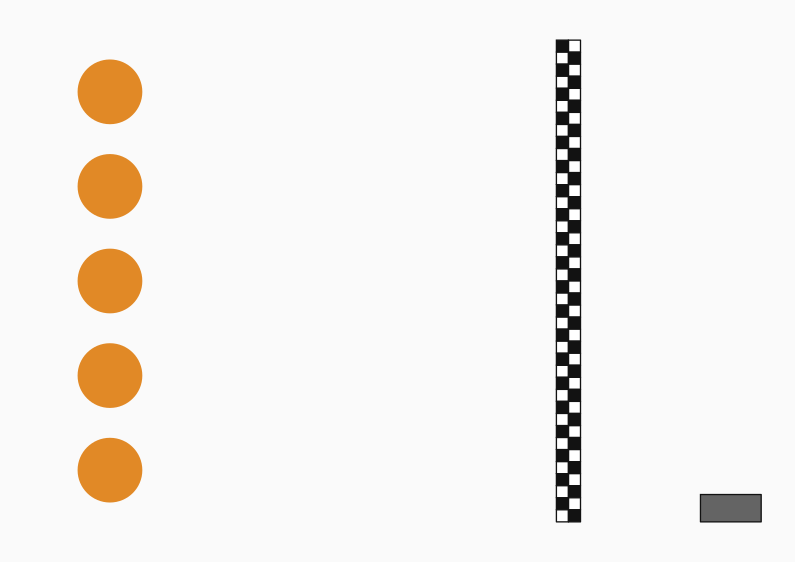
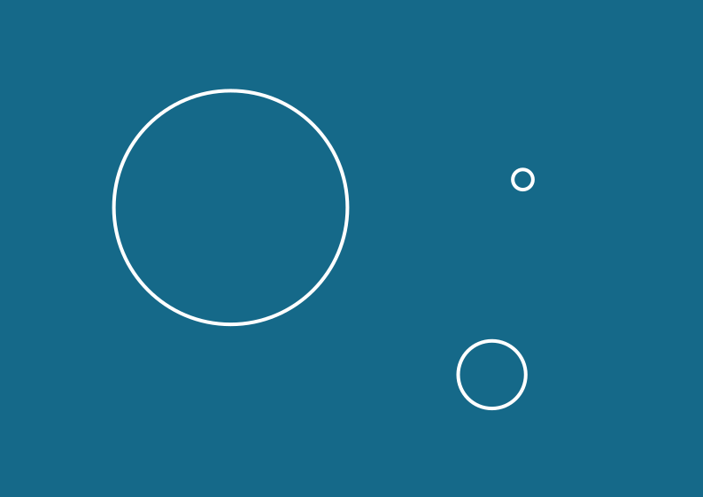
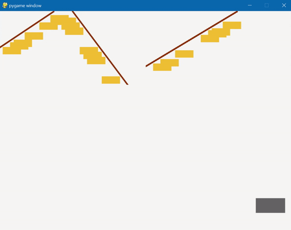
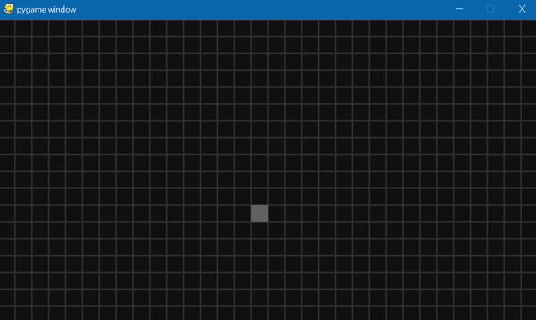

# Lab 6: Исключения (события) и ловля шарика

Лаба: http://cs.mipt.ru/python/lessons/lab6.html.

В качестве ДЗ достаточно решить две задачи: одну по исключениям в Питоне и одну по событиям в Pygame.


## Исключения

## Задача Ex1 (Обработчик для операции Питона)

Напишите функцию, в которой бы использовалась *обработка исключения*.
Далее приведены несколько вариантов функций на выбор (надо сделать что-то одно).

Функция `flexible_get(l, i)`, которая позволяет получить элемент по индексу `i` из списка `l`.
Если индекс выходит за пределы списка, функция должна вернуть `None` (а не бросить `IndexError`).
Если же в качестве индекса передали не целое число, а флотовое, то надо вернуть элемент по округлённому индексу (а не выбросить ошибку, как обычный список Питона при флотовой индексации).

```python
flexible_get(['a', 'b', 'c'], 0)     # a
flexible_get(['a', 'b', 'c'], 100)   #
flexible_get(['a', 'b', 'c'], 0.17)  # a
```

Функция `unbounded_pow(base, exp)`, которая возводит возводит `base` в степень `exp`.
Особенность `unbounded_pow` по сравнению с обычной питоновской `pow` в том, что она не должна выкидывать `OverflowError`: в том случае, если значение получается слишком большим, функция должна вернуть "бесконечность" `float('+inf')` или `float('-inf')` в зависимости от знака результата.[^python-int-arithmetics]

```python
unbounded_pow(2, 2)          # 4
unbounded_pow(2, 10 ** 5)    # <Гигантский вывод с правильным результатом>
unbounded_pow(2.0, 10 ** 5)  # inf
```

Функция `careless_div(a, b)`, которая возвращает результат деления `a` на `b`.
Даже в том случае, когда её просят поделить на ноль: она не бросает `ZeroDivisionError`, а отдаёт "бесконечность" `float('+inf')` или `float('-inf')` в зависимости от знака делимого `a`.
Если же оба аргумента равны нулю, то функция должна вернуть число `-17.5`.

```python
careless_div(4, 2)  # 2
careless_div(5, 2)  # 2.5
careless_div(5, 0)  # inf
```

Функция `meek_add(a, b)`, которая складывает числа `a` и `b`.
Складывает как обычно.
Но функция должна возвращать результат и в том случае, если один или два аргумента — это числа, но в виде *строк*.
Тогда она "не обращает внимания" на типы и просто складывает аргументы как числа.

```python
meek_add(1, 2)               # 3
meek_add(1, '2')             # 3
meek_add('1', '2')           # 3
meek_add('Hello', 'world!')  # Ошибка TypeError, потому что даже для такой add это перебор, она всё-таки хочет только "числовое"
```


## Задача Ex2 (Обработчик для "какой-то" функции)

Дана функция `f` от трёх аргументов.
Она "что-то" считает, возвращает одно флотовое число, но на некоторых входах может бросать ошибку `ZeroDivisionError`.

```python
from math import tan

def cot(x):
    return 1 / tan(x)

def f(a, b, c):
    return (
        1 / (a - b) + 0 ** (2 * c - a) + cot(b ** 2 + c ** 2)
    )
```

В файле [input.txt](./files/input.txt) записаны тройки чисел, по тройке на строчку (когда строки с числами заканчиваются, файл сразу завершается).
Числа отделены друг от друга произвольным числом пробельных символов.

Напишите программу, которая запускает функцию `f` для каждой тройки чисел входного файла и записывает ответы построчно в файл с именем "result.txt".
При этом если возникает ошибка `ZeroDivisionError`, программа падать не должна, а должна записать в качестве ответа для соответствующей тройки чисел строку `"ZeroDivisionError"`.
Если же ошибки нет и всё нормально считается, то ответ перед записью в файл надо округлить до третьего знака после запятой.

Пример:
```
# Вход:
1 2 3
0 0 0

# Выход:
1.160
ZeroDivisionError
```


## События Pygame

### Задача Ev1 (Поймай шарик)

Упражнение из лабы: http://cs.mipt.ru/python/lessons/lab6.html#section-3.

Предлагается в качестве задачи на дом сделать первые несколько пунктов упражнения:
* Реализовать подсчёт очков (*видимо, имеется в виду собственно подсчёт и отображение на экране набранного числа очков*).
* Сделать шарик двигающимся со случайным отражением от стен.
* Реализовать одновременное присутствие нескольких шариков на экране.

("Читабельный код", про который также говорилось в упражнении, предполагается по умолчанию.)


### Задача Ev2 (Тараканьи бега)

Реализуйте с помощью `pygame` соревнование по бегу между тараканами.

В начале игры есть несколько кружков, расположенных на одной прямой в левом конце поля (это тараканы).
На экране есть кнопка "Пуск", при нажатии на которую начинается забег.
Тараканы бегут с разной случайной скоростью.
Как только тараканы пересекают финишную черту, они останавливаются.
Рядом же с тем, кто первым пересечёт финиш, в конце должна появиться "корона" (чтобы было видно, кто победитель).

<p align="center">
  
</p>
<p align="center">
  <em>
    "Эскиз" поля для тараканьего забега перед стартом (сделано не в <code>pygame</code>).
  </em>
</p>


### Задача Ev3 (Круги на воде)

Сделайте с помощью `pygame` так, чтобы по клику левой кнопкой мыши на экране возникал расходящийся круг.

Круг возникает из точки в месте клика мышью и расширяется с постоянной скоростью до тех пор, пока не выйдет за пределы экрана.
При клике мышью в нескольких местах экрана — в каждом возникает свой круг.
Взаимодействие между кругами можно "задвинуть": будет считать, что круги друг на друга никак не влияют.

<p align="center">
  
</p>
<p align="center">
  <em>
    "Эскиз" поверхности воды с тремя кругами: самый большой был создан первым, а в точку возникновения самого маленького буквально только что тыкнули мышью (сделано не в <code>pygame</code>).
  </em>
</p>


### Задача Ev4 (Листья)

Осень, особенно её начало — для Маши это время ассоциируется с какой-то лёгкой, щемящей грустью.
Лето осталось позади, но память о нём ещё свежа, впереди же зима — холод и серость — но до неё ещё далеко.
И осенью оказываешься словно на распутье.
Осень — это время расставания.
Растянутого до той поры, пока на деревьях остаются листья...

Реализуйте с помощью `pygame` анимацию с опадающими листьями.
Есть ветки, на них листья.
По одному листья начинают постепенно опадать.
Падают ровно сверху вних.

На экране должна присутствовать кнопка "Запуска/Паузы", при нажатии на которую процесс опадания листьев или возобновляется, или ставится на паузу (в зависимости от текущего состояния кнопки).
Можно думать о кнопке так: если она нажата, то опадание "включено", если отжата — опадание "выключено" (поставлено на паузу).

Пример:

<p align="center">
  
</p>
<p align="center">
  <em>
    Анимация с листьями в <code>pygame</code>
	(<a href="https://media.giphy.com/media/v1.Y2lkPTc5MGI3NjExODR2dXNvNWlsMDlsZTRqZDh3Y2NqbzBoNmhvNGtpdmFqbnN3MXBlYSZlcD12MV9pbnRlcm5hbF9naWZfYnlfaWQmY3Q9Zw/qjPr8uegsJC9XsfoSH/giphy.gif">gif</a>).
  </em>
</p>


### Задача Ev5 (Интересные картинки)

На старых мобильных телефонах (году в 2000 с чем-то) тоже можно было играть в игры.
Они были "попроще", чем сейчас, и выбор был не такой большой.
Но всё равно поиграть было, во что.
Возможно, самые известные "старые" игры — это <a href="https://en.wikipedia.org/wiki/Snake_(video_game_genre)">Змейка</a> и <a href="https://ru.wikipedia.org/wiki/%D0%A2%D0%B5%D1%82%D1%80%D0%B8%D1%81">Тетрис</a>.
Но для лучшего понимания "истоков" данной задачи важно вспомнить ещё одну игру...

Это игра с платформой, которой нужно было отражать шарик и разбивать им бруски (видимо, она называется <a href="https://ru.wikipedia.org/wiki/Breakout_(%D0%B8%D0%B3%D1%80%D0%B0)">Breakout</a>, или <a href="https://ru.wikipedia.org/wiki/Arkanoid">Arkanoid</a>, или <a href="https://www.heroconcept.com/a-brief-history-of-brick-breaker-video-games/">Brick Breaker</a>).
Таким образом, основная цель состояла в том, чтобы не пропустить шарик и избавиться им от всех брусков.
Это "классический" вариант игры.
По-своему хороший, однако без огонька.
А вот если за брусками ещё была расположена "интересная" картинка, которую очень хотелось бы открыть, то градус игры моментально повышался...

Реализуйте с помощью `pygame` игру с постепенно открывающейся картинкой!
Предлагается немного упростить механику со сравнению с Arkanoid-ом и сделать следующим образом.
Изначально картинка загромождена блоками.
Далее случайный блок "загорается" (становится активным), и если по нему кликнуть левой кнопкой мыши, то он "пропадает" и открывается часть картинки.
Блоки загораются по очереди (то есть не может быть так, что одновременно "активны" два или более блока).

Пример:

<p align="center">
  
</p>
<p align="center">
  <em>
    Анимация с раскрывающейся за блоками картинкой в <code>pygame</code>
	(<a href="https://media.giphy.com/media/v1.Y2lkPTc5MGI3NjExdmdseGhjM2o1ZTZiaThnZHRhdDZiMmp6cHZwdnZzaWxyaXV2azA5eCZlcD12MV9pbnRlcm5hbF9naWZfYnlfaWQmY3Q9Zw/FgFpOwKsdpiE4fbGuo/giphy.gif">gif</a>).
  </em>
</p>


### Задача Ev6 (Свободная)

Реализуйте что-нибудь своё с помощью `pygame`.
Единственные условия — чтобы 1) было "осмысленно", 2) что-то двигалось по экрану и 3) использовались сигналы.


[^python-int-arithmetics]: В Питоне реализована целочисленная <a href="https://ru.wikipedia.org/wiki/%D0%94%D0%BB%D0%B8%D0%BD%D0%BD%D0%B0%D1%8F_%D0%B0%D1%80%D0%B8%D1%84%D0%BC%D0%B5%D1%82%D0%B8%D0%BA%D0%B0">длинная арифметика</a>. Это значит, что целые числа представляются в Питоне как бы не как "обычные числа", а как массивы из цифр. С одной стороны, это, понятно, усложняет логику выполнения операций сложения, вычитания и т.д. 😅 С другой — целые числа в Питоне практически не ограничены по размеру, можно создать сколь угодно большое по модулю целое число. По-другому устроена работа с типом `float`: для чисел с плавающей точкой длинной арифметики нет, и этот тип получается ограниченным. При попытке создать флотовое число, не умещающееся в <a href="https://en.wikipedia.org/wiki/Double-precision_floating-point_format">отведённый ему объём памяти</a>, Питон выбрасывает ошибку переполнения `OverflowError`: <code>2.0 ** (2 ** 9)</code> — ещё ОК, <code>2.0 ** (2 ** 10)</code> — уже не ОК.
